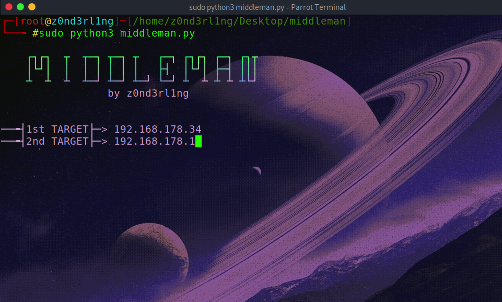

<h1>MIDDLEMAN</h1>

ARP poisoning and DNS spoofing tool - please keep in mind to use this tool for educational purposes only!

 

 <h3>GET STARTED</h3>

         install ettercap and python3
         
         configure /etc/ettercap/etter.dns to redirect targets traffic like this google.com example
         
                  www.google.com  PTR 192.168.178.29
                  www.google.com  A 192.168.178.29
                  *.google.com    A 192.168.178.29
                  *.google.com    AAAA ::

         set INTERFACE and PLUGIN inside the scripts menu-section before use
         
         sudo python3 middleman.py
